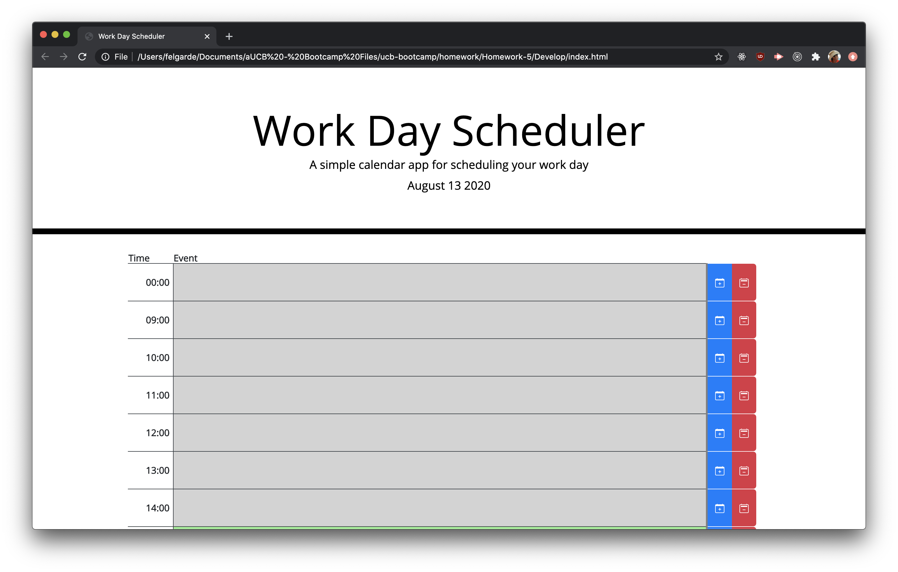
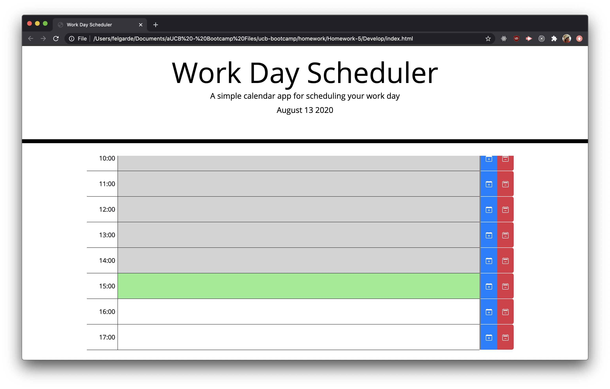
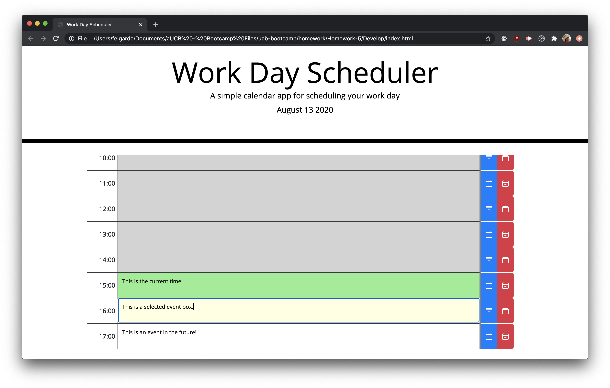

This repository is a week 5 homework submission for UCB Bootcamp

The homework task is to create a calendar using javscript. It should contain the regular office hours for an employee. Each hour, the user can input an activity and when saved, it should persist after being refreshed. The calendar also displays if the time has passed, current or future.

Below are screenshots of the homework from the project

This link goes to the live version of the homework.

[Live homework](https://berjonbatistiana.github.io/Homework-5/)

